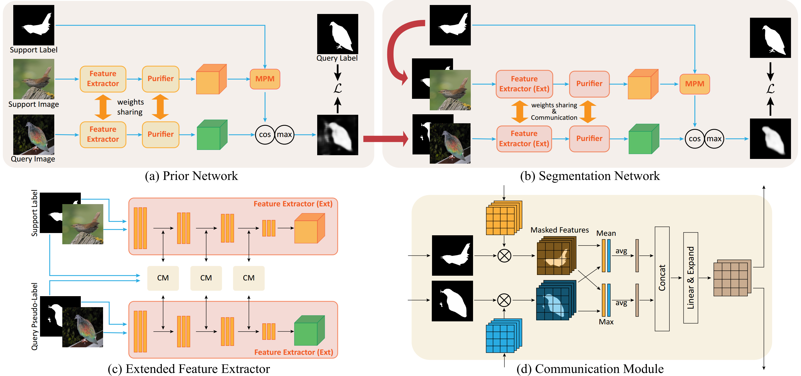
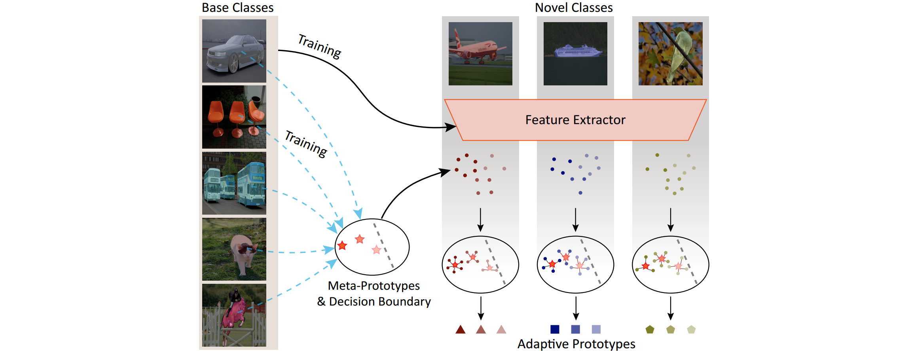
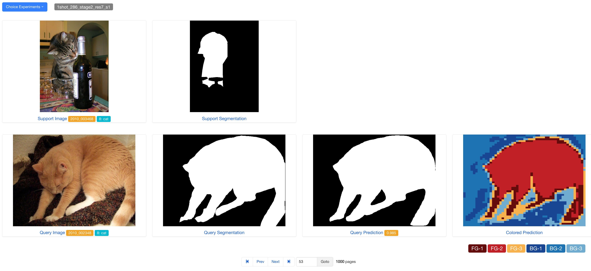

# Prior-Enhanced network with Meta-Prototypes (PEMP)

This is the PyTorch implementation of PEMP.

*   Overview of PEMP



*   Meta-Prototypes & Adaptive Prototypes



### 1. Preliminaries

*   Ubuntu 18.04 (tested)
*   Geforce GTX 2080Ti or Tesla V100 (tested)

#### 1.1 Setup Python Enveriment

```bash
# Install Python and packages
conda create -n torch python=3.7
source activate torch
conda install numpy=1.19.1
conda install pytorch=1.6.0 torchvision=0.7.0 cudatoolkit=10.1 -c pytorch 
conda install tqdm scipy pymongo opencv
pip install sacred==0.8.2 dropblock==0.3.0 pycocotools
```

#### 1.2 Manage Experiments

We utilize **Sacred** for managing experiments (both training and testing). 

If the users only want to perform the inference on PEMP, feel free to skip this subsection and continue on preparing datasets. 

If the users want to re-train PEMP, please refer to [this](./ExperimentManager.md) for setting up the database and visualization tools.

#### 1.3 Prepare Data & Pre-trained Models

Please refer to [this](./data) for preparing the data and pre-trained models.

#### 1.4 Project Structure

*   `./core/` contains the trainer, evaluator, losses, metrics and solver.
*   `./data/` contains the datasets and pre-trained weights of VGG and ResNet.
*   `./data_kits/` contains the data loaders.
*   `./entry/` contains the entry points of the supported models.
*   `./networks/` contains the network implementation of the supported models.
*   `./scripts/` contains the running scripts of the supported models.
*   `./http/` contains the backend and the frontend of the [visualization tools](#4-Visualization).
*   `./utils/` contains a timer, a logger, and some helper functions.
*   `./config.py` contains global configuration and device configuration. 

#### 1.5 Supports (References)

|              | Supports            | Source Link                                     |
| ------------ | ------------------- | ----------------------------------------------- |
| **Datasets** | PASCAL-5i           | http://host.robots.ox.ac.uk/pascal/VOC/voc2012/ |
|              | COCO-20i            | https://cocodataset.org/                        |
| **Models**   | Baseline (ours)     |                                                 |
|              | PEMP (ours)         |                                                 |
|              | PANet               | https://github.com/kaixin96/PANet               |
|              | CaNet (only 1-shot) | https://github.com/icoz69/CaNet                 |
|              | RPMMs (only 1-shot) | https://github.com/Yang-Bob/PMMs                |
|              | PFENet              | https://github.com/Jia-Research-Lab/PFENet      |


### 2. Training and Testing

#### 2.1 Reproducibility

For reproducing the results, please make sure:

1. Install the *exact* versions of packages(python, numpy, pytorch, torchvision and cudatoolkit).

2. Use the random seed `1234` for the packages(random, numpy and pytorch), which is the default setting in the released code.

3. Finish the unittest of the data loaders and get OK to assert the random seed works:

    ```bash
    PYTHONPATH=./ python -m unittest data_kits.pascal_voc_test
    PYTHONPATH=./ python -m unittest data_kits.coco_test
    ```

#### 2.2 Usage

*   Start the MongoDB and Omniboard first.

*   Basic usage

```bash
CUDA_VISIBLE_DEVICES="0" PYTHONPATH=./ python entry/<MODEL>.py <COMMAND> with <UPDATE>
```

*   Parameter explanation

```bash
# <MODEL>:
#     We support several models: baseline, pemp_stage1, pemp_stage2, panet, canet, pfenet
#
# <COMMAND>:
#     We define three commands: train, test, visualize
#     Sacred provide several commands: print_config, print_dependencies
#
# <UPDATE>:
#    The user can update parameters. Please run following command for help.
#        PYTHONPATH=./ python entry/pemp_stage1.py help train
#	     PYTHONPATH=./ python entry/pemp_stage1.py help test
#        PYTHONPATH=./ python entry/pemp_stage1.py help visualize

# Get help for all the parameters
PYTHONPATH=./ python entry/pemp_stage1.py print_config
```

*   For simplicity, we provide some scripts for running experiments

```bash
# Template:
# bash ./scripts/pemp_stage1.sh train 0 [split=0] [shot=1] [data.dataset=PASCAL] [-u] [-p]
# bash ./scripts/pemp_stage1.sh test 0 [split=0] [shot=1] [data.dataset=PASCAL] [exp_id=1] [-u] [-p]
# bash ./scripts/pemp_stage2.sh test 0 [split=0] [shot=1] [data.dataset=PASCAL] [s1.id=1] [exp_id=5] [-u] [-p]

# Step1: Training/Testing PEMP_Stage1
bash ./scripts/pemp_stage1.sh train 0 split=0
bash ./scripts/pemp_stage1.sh test 0 split=0 exp_id=<S1_ID>

# Step2: Training/Testing PEMP_Stage2
bash ./scripts/pemp_stage2.sh train 0 split=0 s1.id=<S1_ID>
bash ./scripts/pemp_stage1.sh test 0 split=0 s1.id=<S1_ID> exp_id=<S2_ID>
```

### 3. Results (ResNet-50)

* PASCAL-5i

|Methods | shots | split-0 | split-1 | split-2 | split-3 |   mIoU  |  bIoU  |
|:------:|:-----:|:-------:|:-------:|:-------:|:-------:|:-------:|:------:|
|Baseline|   1   |  45.48  |  59.97  |  51.35  |  43.31  |  50.03  |  67.58 |
| RPMMS  |       |  53.86  |  66.45  |  52.76  |  51.31  |  56.10  |  70.32 |
|  PEMP  |       |  55.74  |  65.88  |  54.12  |  50.34  |  56.52  |  71.41 |
|        |       |         |         |         |         |         |        |
|Baseline|   5   |  52.47  |  66.31  |  59.85  |  51.02  |  57.41  |  71.90 |
| RPMMS  |       |  56.28  |  67.34  |  54.52  |  51.00  |  57.30  |    -   |
|  PEMP  |       |  58.59  |  69.10  |  60.31  |  53.01  |  60.25  |  73.84 |

* COCO-20i


|Methods | shots | split-0 | split-1 | split-2 | split-3 |   mIoU  |  bIoU  |
|:------:|:-----:|:-------:|:-------:|:-------:|:-------:|:-------:|:------:|
| RPMMS  |   1   |  29.53  |  36.82  |  28.94  |  27.02  |  30.58  |    -   |
|  PEMP  |       |  29.28  |  34.09  |  29.64  |  30.36  |  30.84  |  63.13 |
| RPMMS  |   5   |  33.82  |  41.96  |  32.99  |  33.33  |  35.52  |    -   |
|  PEMP  |       |  39.08  |  44.59  |  39.54  |  41.42  |  41.16  |  70.71 |


### 4. Visualization

We provide a simple tool for visualizing the segmentation prediction and response maps (see the paper). 



#### 4.1 Evaluate and Save Predictions

```bash
# With pre-trained model
bash ./scripts/pemp_stage2.sh visualize 0 s1.id=1001 exp_id=1005

# A test run contains 1000 episodes. For fewer episodes, set the `data.test_n`
bash ./scripts/pemp_stage2.sh visualize 0 s1.id=1001 exp_id=1005 data.test_n=100
```

The prediction and response maps are saved in the directory `./http/static`. 

#### 4.2 Start the Backend

```bash
# Instal flask 
conda install flask

# Start backend
cd http
python backend.py

# For 5-shot
python backend_5shot.py
```

#### 4.3 Start the Frontend

Open the address https://localhost:17002 for browsing the results. ( https://localhost:17003 for 5-shot results)


